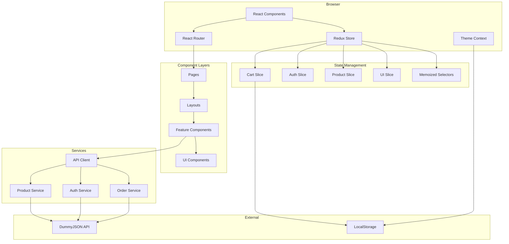
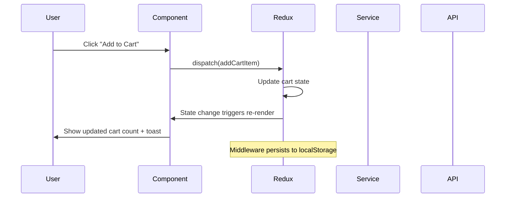

# Architecture Decisions

This document records the key architectural decisions made during the development of the eCom application. Each decision includes context, the decision itself, and consequences.

## ADR-001: SPA Architecture with React

### Context
We needed to choose between SPA (Single Page Application), MPA (Multi-Page Application), or Microfrontends for the e-commerce platform.

### Decision
Use React SPA with client-side routing.

### Rationale
- **Rich interactivity**: E-commerce requires dynamic cart, filters, and product interactions
- **Fast navigation**: After initial load, page transitions are instant
- **Team size**: Single frontend team can manage the entire codebase
- **Complexity**: Product catalog is moderate size; doesn't require microfrontend isolation

### Consequences
- Initial bundle size must be managed (code splitting required)
- SEO requires attention (handled via React Helmet for meta tags)
- Server-side rendering could be added later with Next.js if needed

---

## ADR-002: Redux Toolkit for State Management

### Context
Needed a state management solution for cart, authentication, and UI state.

### Options Considered
1. **Redux Toolkit** - Mature, DevTools, middleware support
2. **Zustand** - Simpler API, less boilerplate
3. **React Context** - Built-in, but limited for complex state
4. **Jotai/Recoil** - Atomic state model

### Decision
Use Redux Toolkit for global state management.

### Rationale
- Cart operations need predictable state updates
- DevTools are invaluable for debugging
- Middleware enables cart persistence and logging
- Interview relevance: Redux knowledge is commonly expected

### Consequences
- More boilerplate than simpler solutions
- Need to carefully manage selector memoization
- Provides clear patterns for scaling

---

## ADR-003: React Hook Form + Zod for Form Handling

### Context
Checkout and authentication require complex form validation.

### Options Considered
1. **React Hook Form + Zod** - Uncontrolled, schema validation
2. **Formik + Yup** - Controlled, established
3. **Custom solution** - Maximum control

### Decision
Use React Hook Form with Zod resolver.

### Rationale
- Uncontrolled components minimize re-renders
- Zod schemas can be shared with backend (Node.js)
- TypeScript-first API with excellent type inference
- Better performance for complex forms

### Consequences
- Learning curve for team unfamiliar with uncontrolled forms
- Excellent form performance out of the box
- Schema reusability enables contract testing

---

## ADR-004: URL State for Filters and Search

### Context
Product filtering and search state needs to be shareable and persist across refreshes.

### Decision
Store filter state in URL query parameters using `useSearchParams`.

### Rationale
- **Shareability**: Users can share filtered views via URL
- **Bookmarking**: Filters persist when bookmarking
- **Navigation**: Browser back/forward works naturally
- **SEO**: Search engines can index filtered pages

### Consequences
- URL complexity increases
- Must sanitize URL inputs
- State updates trigger URL changes

---

## ADR-005: Token Storage Strategy

### Context
Authentication tokens need secure storage.

### Options Considered
1. **localStorage** - Persistent, XSS vulnerable
2. **sessionStorage** - Tab-specific, still XSS vulnerable
3. **HttpOnly Cookies** - Secure, CSRF protection needed
4. **Memory only** - Most secure, lost on refresh

### Decision
For this demo: Store token in memory (React Context) with mock refresh.
For production: Use HttpOnly cookies with CSRF protection.

### Rationale
- Demo doesn't need real persistence
- Memory storage demonstrates the concept
- Production comment documents proper approach

### Consequences
- Users must re-login on page refresh (acceptable for demo)
- Production implementation would need backend support

---

## ADR-006: Component Organization

### Context
Needed to organize 50+ components effectively.

### Options Considered
1. **Flat structure** - All in components/
2. **Feature-based** - Grouped by feature (cart/, checkout/)
3. **Atomic Design** - atoms/molecules/organisms

### Decision
Hybrid: Feature-based for domain components, atomic for shared UI.

### Structure
```
components/
├── ui/          # Atomic: Button, Input, Modal, Toast
├── auth/        # Feature: LoginForm, RegisterForm
├── cart/        # Feature: CartDrawer, CartItem
├── checkout/    # Feature: ShippingForm, PaymentForm
├── product/     # Feature: ProductCard, ProductGrid
└── layout/      # Structural: Navbar, Footer
```

### Consequences
- Clear ownership of components
- Easy to find related components
- UI components are universally reusable

---

## ADR-007: API Client Architecture

### Context
Need consistent error handling and request configuration across API calls.

### Decision
Create a custom `apiClient` wrapper around fetch with:
- Base URL configuration
- Timeout handling
- Error normalization to `ApiError` type
- Request/response typing

### Rationale
- Centralized configuration
- Consistent error shapes for UI
- Easy to swap with axios or add interceptors
- AbortController support for cleanup

### Consequences
- Single point of failure (mitigated by error handling)
- Easy to add authentication headers later
- Consistent loading/error states across app

---

## ADR-008: Testing Strategy

### Context
Need testing approach that provides confidence without slowing development.

### Decision
Three-tier testing pyramid:
1. **Unit tests**: Reducers, selectors, utilities, hooks
2. **Integration tests**: Redux + component flows
3. **Manual E2E**: Critical paths (add to cart, checkout)

### Tools
- Vitest for test runner
- React Testing Library for component tests
- Future: Playwright for E2E

### Rationale
- Unit tests are fast and provide core logic coverage
- Integration tests verify component + Redux interaction
- E2E deferred to production hardening phase

### Consequences
- 60-70% coverage target for critical paths
- CI/CD runs unit + integration tests
- E2E added as project matures

---

## ADR-009: Accessibility Approach

### Context
E-commerce must be accessible to all users.

### Decision
Target WCAG 2.1 AA compliance with:
- Semantic HTML
- ARIA labels for interactive elements
- Keyboard navigation support
- Skip links for main content
- Focus trapping in modals
- Color contrast compliance

### Implementation
- Skip links in MainLayout
- Focus trap in Modal component
- `aria-live` regions for toasts
- Keyboard handlers for custom controls

### Consequences
- Slightly more complex component implementations
- Better user experience for all users
- Reduces legal risk for production use

---

## ADR-010: Performance Monitoring

### Context
Need visibility into real user performance metrics.

### Decision
Implement Core Web Vitals monitoring using `web-vitals` library.

### Metrics Tracked
- **LCP** (Largest Contentful Paint): Loading performance
- **FID** (First Input Delay): Interactivity
- **CLS** (Cumulative Layout Shift): Visual stability
- **TTFB** (Time to First Byte): Server response

### Integration
- Console logging in development
- Ready for analytics service in production
- Thresholds based on Google's Core Web Vitals

### Consequences
- Visibility into real performance
- Can track improvements over time
- Minimal runtime overhead

---

## Architecture Diagram



### Data Flow



---

## Future Considerations

### Not Yet Implemented
1. **Sentry Integration**: Error tracking and session replay
2. **Feature Flags**: Controlled rollouts
3. **A/B Testing**: Experiment framework
4. **PWA**: Offline support and app-like experience
5. **Server-Side Rendering**: For improved SEO and initial load

### Technical Debt
1. Move to React Query/RTK Query for server state
2. Add Storybook for component documentation
3. Implement visual regression testing
4. Add bundle analyzer to CI pipeline
